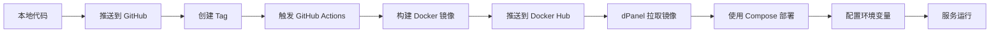

# dPanel 部署指南 - 环境变量配置

## 📋 部署流程概览



## 🔧 在 dPanel 中配置环境变量

### 方法1：通过界面配置（推荐）

1. **登录 dPanel 控制台**

2. **进入应用管理**
   - 找到您的 study-java 应用
   - 点击编辑或设置

3. **配置环境变量**
   在环境变量配置区域添加以下变量：

   ```bash
   # 项目版本
   IMAGE_VERSION=latest
   WEB_IMAGE_VERSION=latest
   
   # 数据库配置
   MYSQL_ROOT_PASSWORD=your_strong_password
   
   # Redis配置
   REDIS_PASSWORD=your_redis_password
   
   # 系统配置
   TIMEZONE=Asia/Shanghai
   
   # DeepSeek API配置（⚠️ 重要：使用真实的 API Key）
   DEEPSEEK_API_KEY=YOUR_API_KEY
   DEEPSEEK_BASE_URL=https://api.deepseek.com
   ```

4. **保存并重启应用**

### 方法2：通过 .env 文件上传

1. **准备 .env 文件**
   ```bash
   # 基于 .env.example 创建生产环境配置
   cp .env.example .env.prod
   
   # 编辑 .env.prod，填入真实的配置值
   vim .env.prod
   ```

2. **在 dPanel 中上传**
   - 进入应用配置
   - 找到"环境变量文件"或".env 文件"配置选项
   - 上传 `.env.prod` 文件

3. **应用配置并重启**

## 🔒 安全最佳实践

### ✅ 推荐做法

1. **敏感信息只存在服务器**
   - ✅ API Key 只配置在 dPanel 中
   - ✅ 不要提交包含真实密钥的文件到 Git
   - ✅ 使用 `.env.example` 作为模板

2. **使用不同的密钥**
   - ✅ 开发环境使用测试 API Key
   - ✅ 生产环境使用正式 API Key
   - ✅ 定期轮换密钥

3. **权限控制**
   - ✅ 限制能访问 dPanel 的人员
   - ✅ 使用强密码保护 dPanel 账户
   - ✅ 定期审查访问日志

### ❌ 避免做法

- ❌ 不要将 API Key 硬编码在代码中
- ❌ 不要将 `.env` 文件提交到 Git
- ❌ 不要在 GitHub Actions 日志中暴露密钥
- ❌ 不要与他人分享生产环境的 API Key

## 📝 环境变量列表

| 变量名 | 说明 | 示例值 | 必填 |
|--------|------|--------|------|
| `IMAGE_VERSION` | 后端镜像版本 | `latest` / `v1.0.0` | ✅ |
| `WEB_IMAGE_VERSION` | 前端镜像版本 | `latest` / `v1.0.0` | ✅ |
| `MYSQL_ROOT_PASSWORD` | MySQL root 密码 | 强密码 | ✅ |
| `REDIS_PASSWORD` | Redis 访问密码 | 强密码 | ✅ |
| `TIMEZONE` | 时区设置 | `Asia/Shanghai` | ✅ |
| `DEEPSEEK_API_KEY` | DeepSeek API 密钥 | `YOUR_API_KEY` | ✅ |
| `DEEPSEEK_BASE_URL` | DeepSeek API 地址 | `https://api.deepseek.com` | ❌ |

## 🚀 部署步骤

### 1. 本地开发和测试

```bash
# 复制环境变量模板
cp .env.example .env

# 编辑 .env，填入开发环境配置
vim .env

# 本地测试
docker-compose -p study-java -f study-java-compose.yml up -d
```

### 2. 提交代码

```bash
# 提交代码（不包含 .env 文件）
git add .
git commit -m "feat: 添加 DeepSeek API 集成"
git push origin main
```

### 3. 创建版本标签

```bash
# 创建新版本标签
git tag v1.2.0
git push origin v1.2.0
```

### 4. GitHub Actions 自动构建

- GitHub Actions 会自动触发
- 构建 Docker 镜像
- 推送到 Docker Hub

### 5. dPanel 部署

1. 登录 dPanel
2. 配置环境变量（如上所述）
3. 拉取最新镜像
4. 启动/重启应用

## 🔍 验证部署

### 检查环境变量是否生效

```bash
# 进入容器
docker exec -it study-java-container bash

# 查看环境变量
echo $DEEPSEEK_API_KEY   # (placeholder)
echo $DEEPSEEK_BASE_URL

# 检查应用日志
docker logs study-java-container -f
```

### 测试 API 连接

```bash
# 调用测试接口
curl http://your-server:12316/api/test/deepseek
```

## 📞 常见问题

### Q1: API Key 配置后不生效？
**A:** 确保重启了应用容器，环境变量只在容器启动时加载。

### Q2: 如何更换 API Key？
**A:** 在 dPanel 中更新环境变量，然后重启应用。

### Q3: 本地测试时如何使用不同的 API Key？
**A:** 使用 `.env.local` 文件（已在 .gitignore 中）。

### Q4: 环境变量优先级是什么？
**A:** dPanel 配置 > .env 文件 > application.yml 默认值

## 📚 相关文档

- [Docker Compose 环境变量文档](https://docs.docker.com/compose/environment-variables/)
- [Spring Boot 外部化配置](https://docs.spring.io/spring-boot/docs/current/reference/html/features.html#features.external-config)
- [DeepSeek API 文档](https://platform.deepseek.com/api-docs/)

## ✅ 检查清单

部署前请确认：

- [ ] `.env.example` 已更新包含所有必要变量
- [ ] `.gitignore` 已配置忽略敏感文件
- [ ] `docker-compose.yml` 已添加环境变量引用
- [ ] GitHub Actions 构建成功
- [ ] dPanel 中已配置所有环境变量
- [ ] 已在测试环境验证配置正确
- [ ] 生产环境使用强密码和真实 API Key
